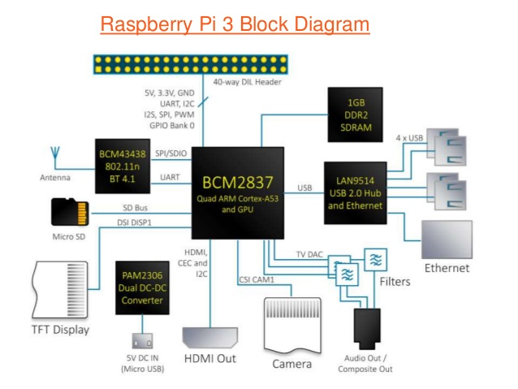

# 用LineageOS編譯Android系統 
[Cyanogen](https://en.wikipedia.org/wiki/Cyanogen)是一間客製化 Android ROM 的公司，旗下產品[CyanogenMod](https://zh.wikipedia.org/wiki/CyanogenMod)（常簡稱為「CM」）是一個基於Android行動裝置平台的開放程式碼系統，它在2016年12月Cyanogen公司突然宣布停止開發並關閉專案基礎設施。LineageOS於2016年12月24日正式啟動就是復刻CyanogenMod，其原始碼存放於[GitHub](https://github.com/LineageOS)。
  
### **開發環境(Host)**
1. 作業系統使用 Ubuntu 18.04
2. 安裝開發套件
    ```bash
    $ sudo apt-get update
    $ sudo apt-get install bc bison build-essential ccache curl flex g++-multilib gcc-multilib git gnupg gperf lib32ncurses5-dev lib32readline-dev lib32z1-dev libesd0-dev liblz4-tool libncurses5-dev libsdl1.2-dev libssl-dev libwxgtk3.0-dev libxml2 libxml2-utils lzop pngcrush rsync schedtool squashfs-tools xsltproc zip zlib1g-dev python-mako imagemagick openjdk-8-jdk gcc-arm-linux-gnueabihf
    ```           
3. OpenJDK version 1.8.0_232 
    ```bash
    # 安裝
    $ sudo apt-get update 
    $ sudo apt-get install openjdk-8-jdk
    # 如果你電腦已經有安裝很多版本JDK，這裡指定要用哪一個版本的JDK
    $ sudo update-alternatives --config java
    ```
    

### **運行環境(Target)**
- **Model:** Raspberry Pi Model 3B V1.2 
- **SoC:** Broadcom BCM2837
- **CPU:** ARM Cortex-A53 (64Bit)
- **記憶體:** 1GB LPDDR2（和 GPU 共享）
- **OS:** lineage 15.1 (Android 8.1.0) \


### 下載 LineageOS 程式碼  
1. 安裝Repo工具
    ```bash
    #建立bin目錄存放Repo
    $ mkdir ~/bin
    $ PATH=~/bin:$PATH
    #下載Repo工具
    $ curl https://storage.googleapis.com/git-repo-downloads/repo > ~/bin/repo
    $ chmod a+x ~/bin/repo
    ```
    > Repo 是google用來管理複合式程式碼的工具，一套Android裡面包含很多不同的專案構成
2. 初始化Repo client端
    ```bash
    # 建立程式碼目錄
    $ mkdir ~/lineageOS-15.1
    $ cd ~/lineageOS-15.1
    ```
    > ~/lineageOS-15.1 是我的主要程式碼工作目錄，你們可以自己定義
    ```bash
    # 設定git名稱和信箱
    $ git config --global user.name "Your Name"
    $ git config --global user.email "you@example.com"
    # 在目前目錄初始化一個client端，指定repository分支lineage-15.1
    $ repo init -u git://github.com/LineageOS/android.git -b lineage-15.1
    ```
    > repo init 會在~/lineageOS-15.1目錄下建立一個.repo/目錄，其中manifest.xml這個檔案內容就包含了建構lineageOS所要用到的專案清單。
3. 下載程式碼
   ```bash
   # 同步遠端程式碼到client端
   $ repo sync -j32 #-j32:是指用32條執行緒下載
   ```
   > 開始下載 repository 大約 66G
#### 參考文件
- [LineageOS 維基百科](https://zh.wikipedia.org/wiki/LineageOS)
- [LineageOS 官方網頁](https://www.lineageos.org/)
- [LineageOS 官方維基](https://wiki.lineageos.org/)
- [LineageOS Github](https://github.com/LineageOS/)
- [Raspberry Pi 3 Model B+ 規格](https://www.raspberrypi.com.tw/10684/55/)
- [LineageOS的所有分支](https://github.com/LineageOS/android/branches/all)
